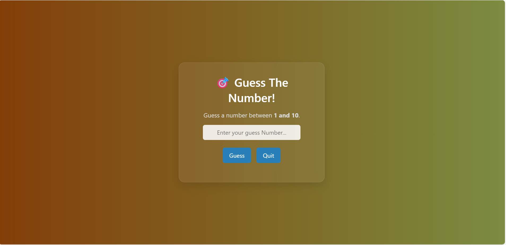

# 🎯 Guess The Number Game

A simple and fun number guessing game built using **HTML**, **CSS**, and **JavaScript**. The user tries to guess a randomly generated number between 1 and 10.

## 🚀 Features

- 🎲 Random number between 1 and 10
- 🧠 Input-based guessing with hints (Too high / Too low)
- 🎉 Success message on correct guess
- 🔁 "Play Again" functionality to restart the game
- ❌ Quit button to end the game
- ✨ Modern UI with responsive and glassmorphic design

## 💻 Tech Stack

- HTML5
- CSS3
- JavaScript 

## 📸 Preview

## ✅ How to Play

1. Enter a number between **1 and 10** in the input field.
2. Click on the **"Guess"** button.
3. You'll receive hints like:
   - 📉 Too low
   - 📈 Too high
   - 🎉 Congratulations if guessed correctly!
4. You can click **"Quit"** to end the game anytime.
5. Click **"Play Again"** to restart the game after winning.